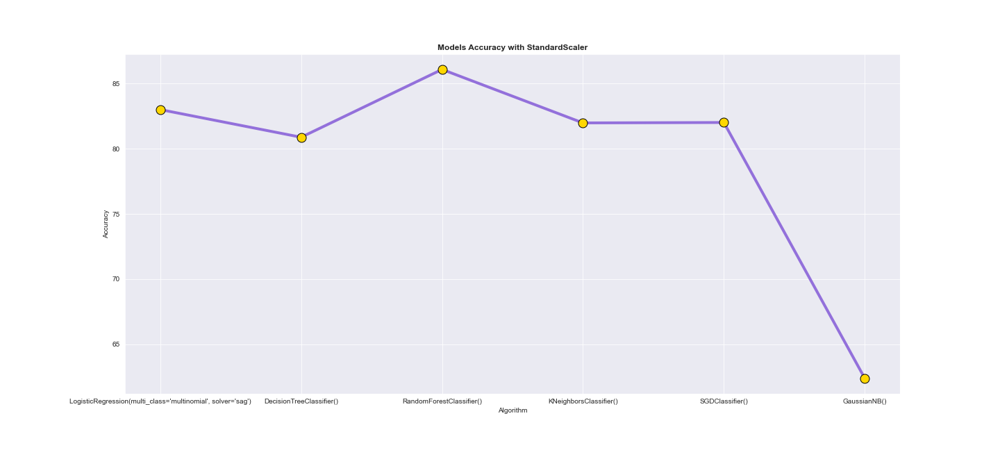

# Machine Learing Project - Formula One Race Predictor

Group Members - Aaaron Simpson, Paaras Dhaliwal, Cragi Braganza , Gaetano Buongiorno , Luke Evans

## Project Outline

Hypothesis: Predict the outcome of a Grand Prix in the 2022 Formula One Season and analyse different machine learning models to find
an optimal strategy which can be applied for sports betting

Model Summary: Compare different machine learning models such as logistic regression, DecisionTreeClassifier, RandomForestClassifier, KNeighborsClassifier, GaussianNB and SGDClassifie to find an optimal model for predicting race outcome and compare the expected returns 

### Data Cleanup and Model Training

a) Data exploration and cleanup process 

By utlising the Ergast Developer API with F1 race results from 1950-2022, we will utilise only relevant data to individual race outcomes and not "constructor"  championship standings . 

b) Problems that may arise

The main problem that arose was the limitations of the data set

+ Potential misaccuracy of data 

+ Data had no subjective indicators of performance e.g. Cognitive Abilities on Race Day

c) Training processes of interest
We scaled the data using StandardScaler and compared 6 different models to see which combination was performing better.

3 Models compared against each other: 

-  Logisitic Regression

-  DecisionTreeClassifier

- RandomForestClassifier

- KNeighborsClassifier

- GaussianNB

- SGDClassifie

### Discussion

a) Findings and results

The best performer model was the RandomForestClassifier with an accuracy of 86.3315. The worse performer model was GaussianNB with an accuracy of 62.3880.

